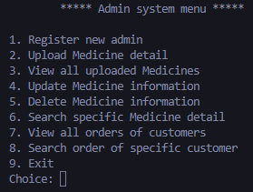
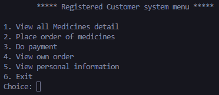

# Pharmacy-Management-System

This is one of my first Python projects, it is a simple program that uses the command line as its interface and it is a system that can help to manage a small pharmacy store. This projects aims to explore basic concepts such as variables, functions, loops etc. Below shows a demo for the program.

 

    

 

    

 

    

