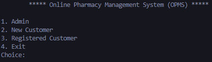

# Pharmacy-Management-System

This is one of my first Python projects, it is a simple program that uses the command line as its interface and it is a system that can help to manage a small pharmacy store. This projects aims to explore basic concepts such as variables, functions, loops etc. Text files were used to act as the database for the program. 

Concepts learned:
- File Handling: Reading and writing in text file
- Functions & Modularity: Segregated the tasks in functions for modularity
- User Input & Output: prompting user for input and displaying organized output
- Conditional Statements: Use of if statements to control the flow of the program
- Loops: Understand the concepts behind loops and how to use them effectively
- Error Handling: Ensuring the program only accepts valid input
- Basic Data Processing: Parsing and processing text files information into a more useful form

Below shows a demo for the program.

 

    

 

    

 

    

